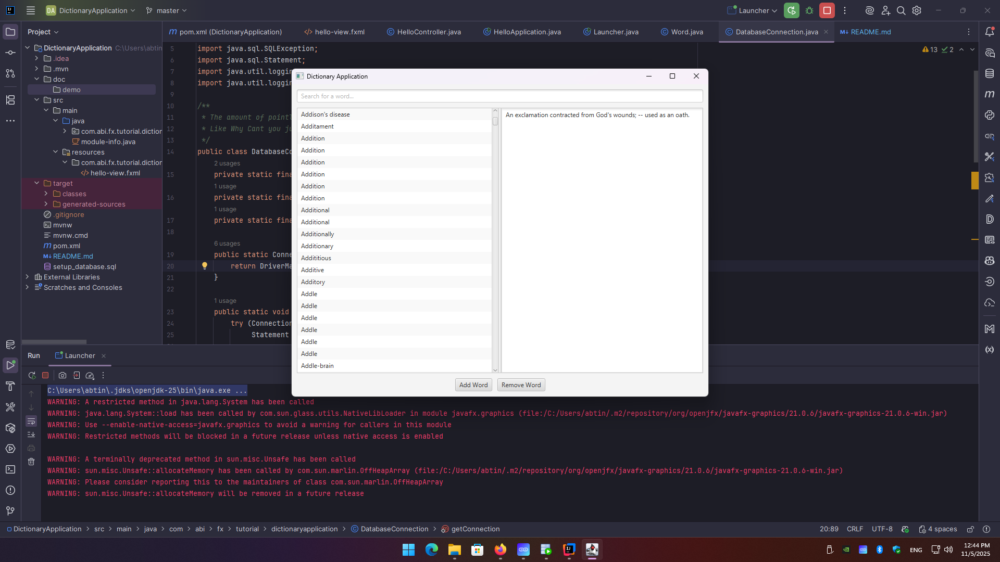

This is Dictionary Program made for my Computer Workshop class instructed by Prof. Ehsan Sadr . 
It's uses the JavaFX framework for UI and Oracle Database for storing the Words. It
has the option to add word as well as delete them. for best use import a csv dictionary beforehand to your database. I
imported [this dictionary](https://github.com/benjihillard/English-Dictionary-Database/blob/main/english%20Dictionary.csv)
to the database for demonstration purposes. 
> [!WARNING]
> currently only supports one dictionary mode.

